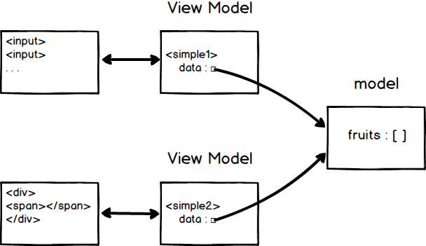

## 2.2 v-bind 디렉티브

- v-bind는 요소(Element)의 콘텐트 영역을 성정하는 것이 아닌 요소 객체의 속성을 바인딩.
- v-bind:src에서 :src로 생략가능.
```HTML
<body>

    <div id="simple">
        <!-- v-bind를 활용하여 모델 객체와 단방향으로 연결시키고 있다. -->
        <input id="a" type="text" v-bind:value="message">
        <br/>
        
    </div>
    <script type="text/javascript">
        // 모델 객체이다. 데이터를 가지고 있다.
        var model = {
            message: 'v-bind 디렉티브',
            imagePath: "http://sample.bmaster.kro.kr/photos/61.jpg"
        };
        // Vue 객체이자 ViewModel 객체. Vue 객체는 HTML 요소와 데이터를 참조하고 있다.
        // data가 변경되면 ViewModel 객체는 즉시 HTML 요소에 반영시킨다.
        var simple = new Vue({
            // el 속성은 HTML요소(Element)
            el: '#simple',
            // data 속성은 모델 객체를 참조한다.
            data: model
        })
    </script>
</body>
```

## 2.3 v-model 디렉티브

- 앞에서 본 디렉티브는 다 단방향. HTML 요소에서 값을 변경하더라도 모델 객체의 값은 유지.

- 양방향 데이터 바인딩이 필요한 경우 v-model 디렉티브 사용.

  
```HTML
<div id="simple">
        <!-- v-model을 활용하여 양방향 데이터 바인딩을 하고 있다. -->
        <input type="text" v-model="name" placeholder="이름을 입력하세요" />
        <br/>
        <p>입력된 이름 :
            <h2 v-html="name"></h2>
        </p>
    </div>
    <script type="text/javascript">
        // 모델 객체이다. 데이터를 가지고 있다.
        var twoway = new Vue({
                el: '#simple',
                data: {
                    name: ''
                }
            })
    </script>
```

- v-model 디렉티브는 여러가지 입력 폼에서도 활용 가능하다.

```HTML
    <div id="simple1">
        <div>좋아하는 과일을 모두 골라주세요 : </div>
        <input type="checkbox" value="1" v-model="fruits">사과,
        <input type="checkbox" value="2" v-model="fruits">키위,
        <input type="checkbox" value="3" v-model="fruits">포도,
        <input type="checkbox" value="4" v-model="fruits">수박,
        <input type="checkbox" value="5" v-model="fruits">참외
    </div>
    <hr/>
    <div id="simple2">
        선택한 과일들 : <span v-html="fruits"></span>
    </div>
    <script type="text/javascript">
        // 모델 객체이다. 데이터를 가지고 있다.
        var model = {
                fruits: []
            }
            // simple1 객체는 요소로 id가 simple1을 갖고 있으며 데이터는 model 객체와 연결되어 있는 View Model이다.
        var simple1 = new Vue({
                el: '#simple1',
                data: model
            })
            // simple2 객체는 요소로 id가 simple2을 갖고 있으며 데이터는 model 객체와 연결되어 있는 View Model이다.
        var simple2 = new Vue({
            el: '#simple2',
            data: model
        })
```




- v-model 디렉티브는 수식어를 가지고 있다.

- lazy : 입력폼에서 이벤트가 발생할 때 입력한 값을 데이터와 동기화. 예를 들어 텍스트 박스에서 입력 후 포커스가 이동할 때 데이터 옵션값이 변경된다.

  ```html
<input type="text" v-model.lazy="name" placeholder="이름을 입력하세요" />
  // 실시간으로 받아오는 것이 아닌 엔터나 다른 이벤트를 발생할 때 입력된다.
  ```

- number : 숫자가 입력될 경우 number 타입으로 자동 형변환 된다.
  ```html
<input type="checkbox" value="1" v-model.number="fruits">사과,
  // value가 "1" 인 문자이더라도 fruits에 반영될땐 1로 들어간다.
  ```
- trim : 문자열의 앞뒤 공백을 자동으로 제거한다.
  ```html
<input type="text" v-model.trim="name" placeholder="이름을 입력하세요" />
  // 공백이 함께 들어가도 제거.
  ```