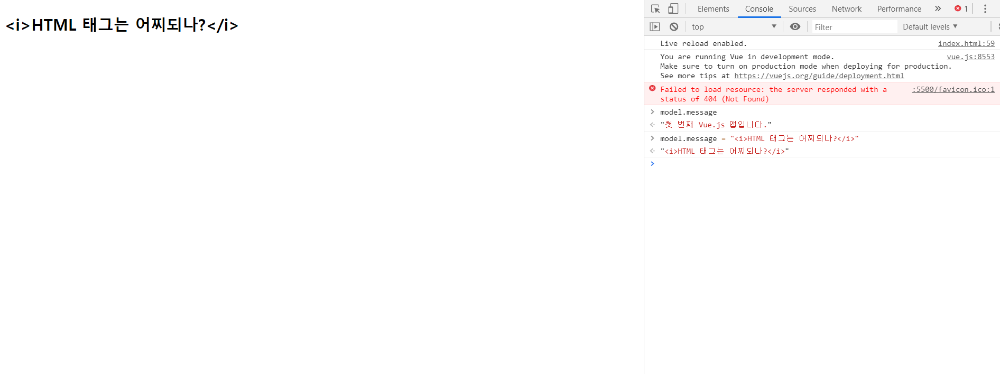

# 01. Vue Start

## 1.1 hellovuejs 분석
```html
<!DOCTYPE html>
<html lang="ko">

<head>
    <meta charset="UTF-8">
    <meta name="viewport" content="width=device-width, initial-scale=1.0">
    <meta http-equiv="X-UA-Compatible" content="ie=edge">
    <title>Hello vue.js</title>
    <script src="https://unpkg.com/vue@2.5.16/dist/vue.js"></script>
</head>

<body>
    <div id="simple">
        <h2>{{message}}</h2>
    </div>
    <script type="text/javascript">
        // 모델 객체이다. 데이터를 가지고 있다.
        var model = {
            message: '첫 번째 Vue.js 앱입니다.'
        };
        // Vue 객체이자 ViewModel 객체. Vue 객체는 HTML 요소와 데이터를 참조하고 있다.
        // data가 변경되면 ViewModel 객체는 즉시 HTML 요소에 반영시킨다.
        var simple = new Vue({
            // el 속성은 HTML요소(Element)
            el: '#simple',
            // data 속성은 모델 객체를 참조한다.
            data: model
        })
    </script>
</body>

</html>
```

- HTML 요소에서는 {{ }} 템플릿 표현식을 사용해 HTML DOM에 데이터를 렌더링 한다.

- 콧수염 모양을 닮았다고 해 콧수염 표현식(Mustache Expression), 문자열을 덧붙인다는 의미로 보간법(Interpolation) 이라 한다.

- Model을 변경하면 ViewModel 객체를 통해 HTML DOM이 즉시 변경된다.

   


## 1.2 기본 디렉티브

### v-text v-html 디렉티브

- HTML에서 디렉티브를 이용해 표현할 수 있다.
```HTML
<div id="simple">
        <!-- {{message}}와 같은 표현을 한다. -->
        <h2 v-text="message"></h2>
    </div>
```

- 기존의 코드에서 v-text로 바꾸었더니 결과는 동일하다.
- console창에서 model.message에 값을 대입하였더니 그대로 표현되었다.



| v-text, {{ }} | innerText 속성에 연결됨. 태그 문자열을 HTML 인코딩하여 나타내기 때문에 화면에는 태그 문자열이 그대로 나타남. |
| ------------- | ------------------------------------------------------------ |
| v-html        | innerHTML 속성에 연결됨. 태그 문자열을 파싱하여 화면에 나타냄. |

- v-text 대신 v-html을 사용한다면 태그도 표현되기 때문에 이탤릭체가 나타난다.

- v-html 디렉티브는 <script> 태그를 그대로 바인딩하기 때문에 XSS(Cross Site Scripting) 공격에 취약하다. 그러므로 v-text를 사용하는 것이 안전하다.

### v-bind 디렉티브

- v-bind는 요소(Element)의 콘텐트 영역을 성정하는 것이 아닌 요소 객체의 속성을 바인딩.
- v-bind:src에서 :src로 생략가능.
```HTML
<body>

    <div id="simple">
        <!-- v-bind를 활용하여 모델 객체와 단방향으로 연결시키고 있다. -->
        <input id="a" type="text" v-bind:value="message">
        <br/>
        
    </div>
    <script type="text/javascript">
        // 모델 객체이다. 데이터를 가지고 있다.
        var model = {
            message: 'v-bind 디렉티브',
            imagePath: "http://sample.bmaster.kro.kr/photos/61.jpg"
        };
        // Vue 객체이자 ViewModel 객체. Vue 객체는 HTML 요소와 데이터를 참조하고 있다.
        // data가 변경되면 ViewModel 객체는 즉시 HTML 요소에 반영시킨다.
        var simple = new Vue({
            // el 속성은 HTML요소(Element)
            el: '#simple',
            // data 속성은 모델 객체를 참조한다.
            data: model
        })
    </script>
</body>
```

### v-model 디렉티브

- 앞에서 본 디렉티브는 다 단방향. HTML 요소에서 값을 변경하더라도 모델 객체의 값은 유지.

- 양방향 데이터 바인딩이 필요한 경우 v-model 디렉티브 사용.

  
```HTML
<div id="simple">
        <!-- v-model을 활용하여 양방향 데이터 바인딩을 하고 있다. -->
        <input type="text" v-model="name" placeholder="이름을 입력하세요" />
        <br/>
        <p>입력된 이름 :
            <h2 v-html="name"></h2>
        </p>
    </div>
    <script type="text/javascript">
        // 모델 객체이다. 데이터를 가지고 있다.
        var twoway = new Vue({
                el: '#simple',
                data: {
                    name: ''
                }
            })
    </script>
```

- v-model 디렉티브는 여러가지 입력 폼에서도 활용 가능하다.

```HTML
    <div id="simple1">
        <div>좋아하는 과일을 모두 골라주세요 : </div>
        <input type="checkbox" value="1" v-model="fruits">사과,
        <input type="checkbox" value="2" v-model="fruits">키위,
        <input type="checkbox" value="3" v-model="fruits">포도,
        <input type="checkbox" value="4" v-model="fruits">수박,
        <input type="checkbox" value="5" v-model="fruits">참외
    </div>
    <hr/>
    <div id="simple2">
        선택한 과일들 : <span v-html="fruits"></span>
    </div>
    <script type="text/javascript">
        // 모델 객체이다. 데이터를 가지고 있다.
        var model = {
                fruits: []
            }
            // simple1 객체는 요소로 id가 simple1을 갖고 있으며 데이터는 model 객체와 연결되어 있는 View Model이다.
        var simple1 = new Vue({
                el: '#simple1',
                data: model
            })
            // simple2 객체는 요소로 id가 simple2을 갖고 있으며 데이터는 model 객체와 연결되어 있는 View Model이다.
        var simple2 = new Vue({
            el: '#simple2',
            data: model
        })
```

<center></center>
- v-model 디렉티브는 수식어를 가지고 있다.

- lazy : 입력폼에서 이벤트가 발생할 때 입력한 값을 데이터와 동기화. 예를 들어 텍스트 박스에서 입력 후 포커스가 이동할 때 데이터 옵션값이 변경된다.

  ```html
    <input type="text" v-model.lazy="name" placeholder="이름을 입력하세요" />
  // 실시간으로 받아오는 것이 아닌 엔터나 다른 이벤트를 발생할 때 입력된다.
  ```

- number : 숫자가 입력될 경우 number 타입으로 자동 형변환 된다.
  ```html
    <input type="checkbox" value="1" v-model.number="fruits">사과,
  // value가 "1" 인 문자이더라도 fruits에 반영될땐 1로 들어간다.
  ```
- trim : 문자열의 앞뒤 공백을 자동으로 제거한다.
  ```html
    <input type="text" v-model.trim="name" placeholder="이름을 입력하세요" />
  // 공백이 함께 들어가도 제거.
  ```

### v-show, v-if, v-else, v-else-if 디렉티브

1. **v-if**  *vs*  **v-show**

   - Vue 객체의 data 속성 값에 따라 렌더링 여부를 결정.

   - 다른 언어에서 많이 쓰이는 if문과 동일.

   - v-show 와 매우 비슷하지만 렌더링 여부에 차이가 있다.

   - v-if는 조건에 부합되지 않으면 렌더링을 하지 않는다. 반면에 v-show는 일단 HTML 요소를 렌더링 후에 display 스타일 속성으로 화면에 보여줄지 말지 결정한다. 

     ```HTML
     <div id="account">
         예금액 : <input type="text" v-model="amount" />
             
         </div>
         <script type="text/javascript">
             var simple1 = new Vue({
                     el: '#account',
                     data: {
                         amount: 0
                     }
            })
     ```
     
   - v-if는 조건에 부합하지 않으면 렌더링을 하지 않는다. 그렇기 때문에 자주 화면이 변경되는 부분은 v-show를 사용하는 것이 바람직하다.
   
   - v-show는 렌더링은 하였지만 img display 스타일 속성만 변화를 주어 처리한다.
   
2. v-if, v-else, v-else-if

   ```HTML
       <div id="account">
           잔고 : <input type="text" v-model="balance" />
           <br/> 회원님의 등급 :
           <span v-if="balance >= 1000000">Gold</span>
           <span v-else-if="balance >= 500000">Silver</span>
           <span v-else-if="balance >= 200000">Bronze</span>
           <span v-else>Basic</span>
       </div>
       <script type="text/javascript">
           var simple1 = new Vue({
                   el: '#account',
                   data: {
                       balance: 0
                   }
               })
   ```

   - balance 값에 따른 문자가 출력된다.
### v-for 디렉티브

- v-for는 이름에서도 알 수 있듯이 같은 행동을 반복할 때 사용한다.

```HTML
<!DOCTYPE html>
<html lang="ko">

<head>
    <meta charset="UTF-8">
    <meta name="viewport" content="width=device-width, initial-scale=1.0">
    <meta http-equiv="X-UA-Compatible" content="ie=edge">
    <title>v-for</title>
    <style>
        #list {
            width: 400px;
            border: 1px solid black;
            border-collapse: collapse;
        }
        
        #list td,
        #list th {
            border: 1px solid black;
            text-align: center;
        }
        
        #list>thead>tr {
            color: yellow;
            background-color: purple;
        }
    </style>
    <script src="https://unpkg.com/vue@2.5.16/dist/vue.js"></script>
</head>

<body>
    <div id="example">
        <table id="list">
            <thead>
                <tr>
                    <th>번호</th>
                    <th>이름</th>
                    <th>전화번호</th>
                    <th>주소</th>
                </tr>
            </thead>
            <tbody id="contacts">
                <tr v-for="contact in contacts">
                    <td>{{contact.no}}</td>
                    <td>{{contact.name}}</td>
                    <td>{{contact.tel}}</td>
                    <td>{{contact.address}}</td>
                </tr>
            </tbody>
        </table>
    </div>
    <script type="text/javascript">
        var model = {
            "pageno": 1,
            "pagesize": 10,
            "totalcount": 100,
            "contacts": [{
                "no": 100,
                "name": "설현",
                "tel": "010-3456-8299",
                "address": "서울"
            }, {
                "no": 99,
                "name": "혜리",
                "tel": "010-3456-8298",
                "address": "서울"
            }, {
                "no": 98,
                "name": "하니",
                "tel": "010-3456-8297",
                "address": "경기"
            }, {
                "no": 97,
                "name": "성소",
                "tel": "010-3456-8296",
                "address": "제주"
            }, {
                "no": 96,
                "name": "지아",
                "tel": "010-3456-8295",
                "address": "서울"
            }, {
                "no": 95,
                "name": "정연",
                "tel": "010-3456-8294",
                "address": "서울"
            }, {
                "no": 94,
                "name": "쯔위",
                "tel": "010-3456-8293",
                "address": "강원"
            }, {
                "no": 93,
                "name": "사나",
                "tel": "010-3456-8292",
                "address": "일본"
            }, {
                "no": 92,
                "name": "모모",
                "tel": "010-3456-8291",
                "address": "서울"
            }, {
                "no": 91,
                "name": "소진",
                "tel": "010-3456-8290",
                "address": "충남"
            }]
        }
        var list = new Vue({
            el: "#example",
            data: model
        })
    </script>
</body>

</html>
```

실행결과

<center></center>
- 코드에서 contacts의 배열의 요소를 반복하기 위한 v-for 디렉티브이다.

- v-for의 구문은 원본데이터에 따라 형식이 달라진다.

- 원본 데이터가 객체인 경우 키를 이용해 값에 접근하는 해쉬맵(HashMap) 구조이기 때문에, key, value 값을 얻어낼 수 있는 구조를 사용한다.

```HTML

```